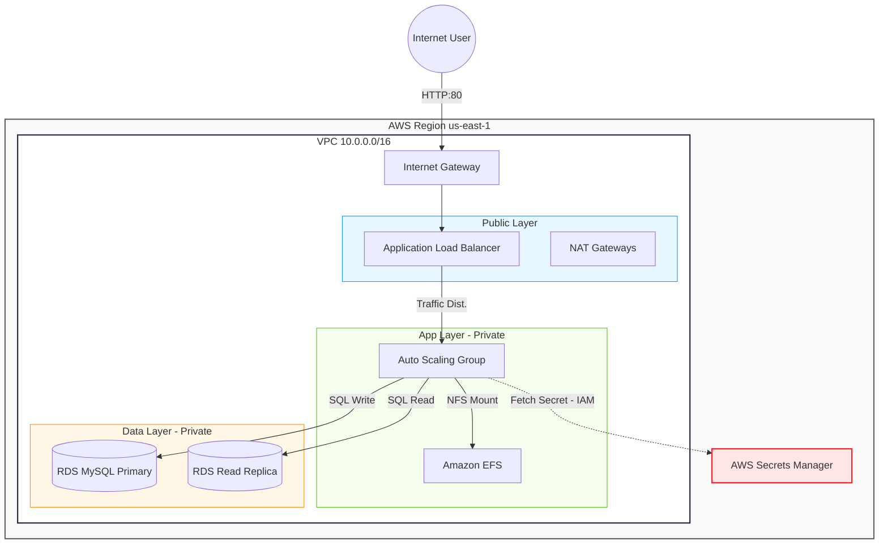

# AWS Capstone Project

> **Production-Ready, Modular, and Secure WordPress Infrastructure on AWS.**

This project deploys a highly available, fault-tolerant, and secure WordPress environment using **Terraform**. It adheres to "DevOps Architect" standards, featuring Zero Trust IAM roles, AWS Secrets Manager integration for credential security, and a strictly modular architecture.

---

##  Architecture

The infrastructure implements a 3-Tier Architecture distributed across 2 Availability Zones for maximum resilience.



##  Key Features

*   **Modular Design**: Reusable modules for Networking, Database, Compute, Storage, and ALB.
*   **Security First**:
    *   **Secrets Manager**: Database passwords are auto-generated and never exposed in code.
    *   **Zero Trust IAM**: EC2 instances have granular permissions (`secretsmanager:GetSecretValue`).
    *   **Private Isolation**: Compute and Data layers are strictly private (No Public IPs).
*   **High Availability**:
    *   Multi-AZ implementation for all layers.
    *   Auto Scaling Group with Self-Healing capabilities.
    *   RDS Primary + Read Replica architecture.
*   **Standardization**: Enforced tagging strategy (`CostCenter`, `Owner`, `ManagedBy`) for FinOps.

## Project Structure

```bash
.
├── main.tf                 # Root orchestration
├── variables.tf            # Global variables
├── locals.tf               # Tagging & Naming logic
├── outputs.tf              # Critical endpoints (URL, DB Host)
├── terraform.tfvars        # (Optional) Custom variable values
├── install_wordpress.sh    # User Data Bootstrap Script
│
└── modules/
    ├── networking/         # VPC, Subnets, Gateways, Routes
    ├── compute/            # ASG, Launch Template, IAM Roles
    ├── database/           # RDS MySQL, Secrets Manager
    ├── storage/            # EFS File System
    └── alb/                # Load Balancer, Target Group, Listeners
```

##  Deployment Guide

### Prerequisites
*   Terraform v1.0+
*   AWS CLI configured with appropriate credentials.

### Installation

1.  **Initialize**:
    Download providers and modules.
    ```bash
    terraform init
    ```

2.  **Plan**:
    Review the infrastructure changes.
    ```bash
    terraform plan
    ```

3.  **Apply**:
    Provision the infrastructure.
    ```bash
    terraform apply
    ```

4.  **Access**:
    Get the website URL from the output:
    ```bash
    terraform output website_url
    ```

##  Clean Up

To destroy all resources:
```bash
terraform destroy
```

---
**Managed by:** DevOps Team | **Cost Center:** CC-101
